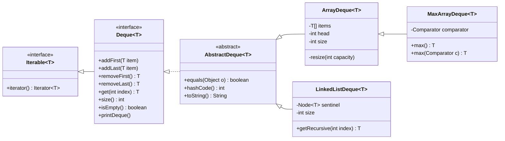

<div align="center">

# Deque

**Two from-scratch, generic double-ended queues in Java: a resizable circular array and a sentinel-based doubly linked list, both held to the same tested contract.**

[](https://github.com/tefaa1/Deque/actions/workflows/ci.yml)


[](LICENSE)

</div>

---

## Highlights

- **Two implementations, one interface.** `ArrayDeque` (circular buffer) and `LinkedListDeque` (circular doubly linked list) are interchangeable behind `Deque<T>`, and they compare equal to each other when they hold the same items.
- **O(1) at both ends.** Amortized constant-time `addFirst` / `addLast` / `removeFirst` / `removeLast`, and O(1) random access on the array version.
- **Memory that follows the data.** The array doubles when full and halves when less than 25% is used, with hysteresis so it never resizes back and forth.
- **Behaves like a real Java collection.** It is `Iterable` with fail-fast iterators (`ConcurrentModificationException`), uses value-based `equals` / `hashCode` consistent with `java.util.List`, prints readably with `toString`, and supports `null` items.
- **Tested against the JDK.** 87 JUnit 5 tests, including a 200,000-operation randomized test that checks every result against `java.util.LinkedList`.
- **Zero runtime dependencies.** The build compiles with `-Xlint:all -Werror` and CI runs on JDK 17, 21 and 25.

## Implementations

| Class | Backed by | Best when |
| --- | --- | --- |
| [`ArrayDeque<T>`](src/main/java/deque/ArrayDeque.java) | Resizable circular array | You need fast indexed access and good cache locality |
| [`LinkedListDeque<T>`](src/main/java/deque/LinkedListDeque.java) | Circular doubly linked list with a sentinel | You need strictly O(1) (not amortized) inserts and removes |
| [`MaxArrayDeque<T>`](src/main/java/deque/MaxArrayDeque.java) | `ArrayDeque` + `Comparator` | You also need the maximum item by a default or per-call ordering |

### Time complexity

| Operation | `ArrayDeque` | `LinkedListDeque` |
| --- | :---: | :---: |
| `addFirst` / `addLast` | O(1) amortized | O(1) |
| `removeFirst` / `removeLast` | O(1) amortized | O(1) |
| `get(i)` | **O(1)** | O(min(i, n − i)) |
| `getRecursive(i)` | n/a | O(i) |
| `size` / `isEmpty` | O(1) | O(1) |
| Full iteration | O(n) | O(n) |
| `equals` / `hashCode` / `toString` | O(n) | O(n) |
| Space | Θ(n), at most 4n slots | Θ(n) nodes |

`MaxArrayDeque.max()` is O(n).

## Usage

```java
Deque<Integer> deque = new ArrayDeque<>();
deque.addLast(2);
deque.addLast(3);
deque.addFirst(1);                  // [1, 2, 3]

deque.get(1);                       // 2
deque.removeLast();                 // 3
deque.removeFirst();                // 1
deque.removeFirst();                // 2
deque.removeFirst();                // null: empty deques return null instead of throwing

for (int x : deque) { /* ... */ }   // every Deque is Iterable

// Equality is by contents, across implementations:
Deque<String> a = new ArrayDeque<>();
Deque<String> b = new LinkedListDeque<>();
a.addLast("x");
b.addLast("x");
a.equals(b);                        // true, and a.hashCode() == b.hashCode()

// Max by a default or a per-call comparator:
MaxArrayDeque<String> fruit = new MaxArrayDeque<>(Comparator.naturalOrder());
fruit.addLast("pear");
fruit.addLast("banana");
fruit.addLast("fig");
fruit.max();                                        // "pear"
fruit.max(Comparator.comparingInt(String::length)); // "banana"
```

## How it works

### `ArrayDeque`: a circular buffer

The items live in `size` consecutive slots starting at `head`, wrapping around the end of the array. Adding or removing at either end only moves `head` or the implicit tail, so no element is ever shifted.

```text
  capacity = 8, head = 6, size = 5             logical order: [A, B, C, D, E]

  index:   0     1     2     3     4     5     6     7
        ┌─────┬─────┬─────┬─────┬─────┬─────┬─────┬─────┐
        │  C  │  D  │  E  │     │     │     │  A  │  B  │
        └─────┴─────┴─────┴─────┴─────┴─────┴─────┴─────┘
                             ▲           ▲     ▲
                             │           │     └── head: the front item
                             │           └──────── addFirst writes here, at head − 1
                             └──────────────────── addLast writes here, at head + size
```

- **Power-of-two capacity.** The capacity is always 8, 16, 32 and so on, so a logical index maps to a slot with a bit mask, `(head + i) & (capacity − 1)`, instead of a slower `%` that also needs extra care for negative numbers.
- **Growth.** When the array is full it doubles, and the two contiguous runs are copied in order with `System.arraycopy`.
- **Shrinking with hysteresis.** For capacities of 16 or more, the array halves as soon as fewer than ¼ of its slots are used. Growth happens at 100% and shrinking below 25%, so a resize always leaves the array half full. Many cheap operations must then happen before the next resize, which keeps every operation O(1) amortized and memory within 4× the item count.
- **No loitering.** Removed slots are set to `null` so the garbage collector can reclaim the items.

### `LinkedListDeque`: a circular list with one sentinel

```text
       ┌─────────────────────────────────────────┐
       ▼                                         ▼
  ┌──────────┐      ┌─────┐      ┌─────┐      ┌─────┐
  │ sentinel │ ◀──▶ │  A  │ ◀──▶ │  B  │ ◀──▶ │  C  │
  └──────────┘      └─────┘      └─────┘      └─────┘
                       ▲                         ▲
                 sentinel.next             sentinel.prev
                    (front)                   (back)
```

One sentinel node is both "before the first" and "after the last" node. An empty deque is the sentinel pointing to itself, so every insert and removal is the same four-pointer splice, with no `null` checks and no special case for the first or last item. `get(i)` walks from whichever end is closer. Removed nodes have their links cleared so they don't keep other nodes reachable.

### Class design



- **`AbstractDeque`** defines `equals`, `hashCode` and `toString` once, in terms of iteration, the same way `java.util.AbstractList` does. Every implementation therefore compares and prints the same way, and the hash formula matches `List.hashCode()`.
- **Iterators walk the structure directly.** An earlier version iterated by calling `get(i)` in a loop, which made a full pass over the linked list O(n²): iterating 100,000 items took about **5.3 s**. Walking the nodes makes it O(n), and 1,000,000 items now take about **5 ms**.
- **Fail-fast iteration.** Each deque keeps a modification count. An iterator that notices a structural change made after it was created throws `ConcurrentModificationException` instead of returning wrong data.
- **`Node<T>` is a `static` nested class,** so a node doesn't carry a hidden reference to its enclosing deque.
- **`MaxArrayDeque` accepts `Comparator<? super T>`,** so a `Comparator<Number>` works for a `MaxArrayDeque<Integer>`.

## Testing

```text
src/test/java/deque/
├── DequeContractTest.java    abstract: the specification every Deque must meet
├── ArrayDequeTest.java       contract + resizing, wrap-around and capacity invariants
├── LinkedListDequeTest.java  contract + getRecursive
└── MaxArrayDequeTest.java    contract + max() and comparator handling
```

- **Contract tests.** The behaviour is written once in an abstract `DequeContractTest`, and each implementation's test class only supplies a factory method. All three classes run the same specification, so a new implementation is a three-line test class away from full coverage.
- **Differential (randomized) testing.** A seeded run of 200,000 random `addFirst`, `addLast`, `removeFirst`, `removeLast` and `get` calls is mirrored on `java.util.LinkedList`, and every return value and size is compared. The run alternates growing and shrinking phases, so the deque repeatedly empties, wraps around, grows and shrinks.
- **Invariant tests.** These cover the 25% minimum usage during shrinking, power-of-two capacities, order kept across a resize of a wrapped-around array, and no resize thrashing at a boundary.
- **Edge cases.** These cover empty deques, out-of-bounds and negative indexes, `null` items, exhausted and fail-fast iterators, equality across implementations, and 1,000,000-item workloads.

## Getting started

Requires **JDK 17 or newer**. Maven is not needed because the project includes the Maven Wrapper.

```bash
git clone https://github.com/tefaa1/Deque.git
cd Deque
./mvnw test          # on Windows: mvnw.cmd test
```

To build a jar instead, run `./mvnw package`, which writes `target/deque-1.0.0.jar`.

## Project structure

```text
.
├── src/main/java/deque/
│   ├── Deque.java             the interface
│   ├── AbstractDeque.java     shared equals / hashCode / toString
│   ├── ArrayDeque.java        circular-array implementation
│   ├── LinkedListDeque.java   sentinel doubly-linked-list implementation
│   └── MaxArrayDeque.java     ArrayDeque with max()
├── src/test/java/deque/       JUnit 5 test suite
├── .github/workflows/ci.yml   CI on JDK 17, 21 and 25
└── pom.xml
```

## Acknowledgements

The `Deque` API follows Project 1 of [UC Berkeley's CS 61B: Data Structures](https://sp21.datastructur.es/). The implementations, the design described above and the test suite are my own work.

## License

[MIT](LICENSE) © Mohamed Abdellatif ([@tefaa1](https://github.com/tefaa1))
